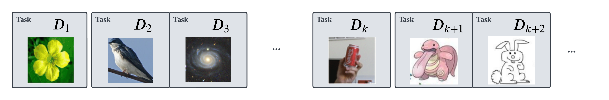

# Auto-Dataset (AutoDS)



This repository implements the logic for processing and managing a large sequence of datasets.

AutoDS can automatically download and process dataset from:
* Kaggle
* Publicly accessible via a URL, HTTP, FTP, or Google Drive link
* Locally stored
* git repository

It can be extended to any dataset where only the logic of extracting and processing the dataset is required via sub-classing and method over-writing of a [Dataset](autods/dataset.py) class.

## Why Auto-Dataset?

AutoDS provides a method to automatically construct a sequence of tasks by projecting multiple datasets on the same dimension.
A collection of 82 datasets are currently in AutoDS with easy extension of more possible dataset.
AutoDS offers convenient management to datasets and sourcing, and feature extraction utilities from
pre-trained models to speed up & evaluate on downstream scenarios.

### Inter-Disciplinary Tasks

- Text (e.g. Yelp)
- Vision (e.g. CIFAR-10, Places-365)

### Feature Vectors

We provide the preprocessed features to download for 82 datasets.
Features from state-of-the-art models CLIP, GPT2, ResNet, and ViT support fast evaluation by training a small downstream model, as well as multi-modal learning. Our feature vector dataset is a **performant** memory mapped database (LMDB).

## Install

### Requirements

AutoDS has been tested on Ubuntu 18.04 and Python 3.10.
For extracting archives the following must be installed in your system and be on Path.

* [patool](https://wummel.github.io/patool/)
* [unrar](https://packages.ubuntu.com/search?keywords=unrar)

**Kaggle Set-up**

AutoDS uses Kaggle API to download the Kaggle datasets, you need to authenticate the API token before downloading.
Follow the instruction of [Kaggle API: Getting Started: Installation & Authentication](https://www.kaggle.com/docs/api)
to setup Kaggle.

**Feature Extraction**

For extracting features, you will need `ray` for distributed execution. There is no support without using ray as it is prohibitively slow.

There are optional dependencies for feature extraction not included with AutoDS. You will need to install with the following commands:

`pip install autods[dist]`

**Development**

To contribute to this repository, you will need to install with option `[dev]`

`pip install autods[dev]`

### [Download Features](https://drive.google.com/file/d/1insLK3FoGw-UEQUNnhzyxsql7z28lplZ/view?usp=sharing)

Extract `stream_feats.tar` and place it on the `root_dir` of your choice.

## Examples

### Basic Usage

**Loading a single dataset**

Easy to use the built-in 82 datasets with the pre-processed feature vectors.
A single dataset can be loaded by specifying `task_id` while arguments specific to the dataset can be passed by `datasets_kwargs`.
The dataset is a Pytorch Dataset class and can be used with [Pytorch DataLoader](https://pytorch.org/docs/stable/data.html) utilities.
The list of supported datasets and their corresponding dataset names and task-ids can be found [HERE](assets/DATASET_TABLE.md).
An example:

```python
custom_kwargs = {
    # some datasets are built with different sub-task splits
    'core50': {
        'subset_name': 'object',
        'transform': your_custom_transform,
        'train': False,
    },
}
# load Core50
ds = AutoDS(root_path, task_id=15, datasets_kwargs=custom_kwargs)
dl = DataLoader(ds, *args, **kwargs)
```

**Loading a subset of all datasets**

To use a subset of datasets you can specify them as a list by their name.

**IMPORTANT**: task-ids will be re-mapped by the alphabetical order of the list of datasets.

```python
# use only the above three datasets, with dataset-ids:
# cifar10 - 0, svhn - 1, tinyimagenet - 2
use_datasets = ['cifar10', 'svhn', 'tinyimagenet']
ds_cifar10 = AutoDS(root_path, task_id=0, datasets=use_datasets)
```

**Loading all datasets as one big dataset**

Alternatively, load all datasets as a `ConcatDataset` by setting `task_id=None`:

```python
# load all datasets
all_ds = AutoDS(root_path, task_id=None, datasets=custom_args)
dl = DataLoader(all_ds, *args, **kwargs)
```

**Using extracted feature vectors**

After having downloaded and extracted the feature vectors from the previous step, you can load the feature vectors corresponding to the default extractor of each dataset by setting `feats_name="default"`:

```python
# load dataset as feature vectors
feats_ds = AutoDS(root_path, task_id=your_task_id, feats_name="default")
```

**Making dataset metadata**

If not using the extracted features, you will need to download the
data source files where downloading and processing is automated:

```python
# load dataset as raw images/texts
raw_ds = AutoDS(root_path, task_id=your_task_id, make=True)
```

**NOTE** as our pre-processing method depends on dataset hosted by third-parties that can change both the dataset contents or distribution methods, many of the datasets currently included in Auto-Dataset fail to Download with modifying our updating the existing dataset class. We are working on re-distributing the dataset for which there is a permisive license to do so.

### Adding New Dataset

You can fork this repository and add your own dataset and you are welcome to create a PR.

Follow the example in [test_dataset.py](tests/test_dataset.py) and complete the following abstract properties/methods:

- `metadata_url`: Url to dataset webpage.
- `remote_urls`: File names and download urls. See [here](assets/REMOTE_SOURCES.md) for loading and processing different types of sources.
- `name`: Dataset name.
- `file_hash_map`: MD5 hash map of data files for verification.
- `dataset_type`: Dataset modality, one of `image` and `text`.
- `default_task_name`: Default subset of the dataset. `none` if no subset.
- `task_names`: List of all subsets. `['none']` if no subset.
- `_process()`: Custom pre-process of downloaded files, e.g. extracting archives.
- `_make_metadata()`: Custom file-to-label mapping.

**IMPORTANT:** adding new datasets will create a new set of task-ids for loading the datasets.
To check the new task-ids in AutoDS, run:

```python
ds = AutoDS(root_path)
print(list(enumerate(ds.task_names))
```

In the first use of your dataset, AutoDS will need to download, extract the files, and making the metadata by:

```python
ds = AutoDS(root_path, task_id=your_task_id, make=True, clean=True)
```

Finally, your custom dataset can be loaded with Basic Usage.

### Extracting Features

AutoDS supports the following pre-trained models for extracting feature vectors:

* CLIP [Text/Vision]
* GPT2 [Text]
* ResNet [Vision]
* ViT [Vision]

To extract the features for a dataset, pass the feature extractor name when making the dataset.
Specify `batch_size` and `num_gpus` for speeding up extraction.

```python
ds = AutoDS(
    root_path, task_id=your_task_id, feats_name="clip",
    make=True, clean=True, batch_size=128, num_gpus=0.2,
)
# or
ds = your_ds_class(tmp_path, clean=True, **kwargs)
ds.make_features(batch_size, 'cuda', feats_name="clip", clean=True)
```

The feature dataset can be loaded as in Basic Usage.


## Cite


```bibtex
@inproceedings{fostiropoulos2023batch,
  title={Batch Model Consolidation: A Multi-Task Model Consolidation Framework},
  author={Fostiropoulos, Iordanis and Zhu, Jiaye and Itti, Laurent},
  booktitle={Proceedings of the IEEE/CVF Conference on Computer Vision and Pattern Recognition},
  pages={3664--3676},
  year={2023}
}
```